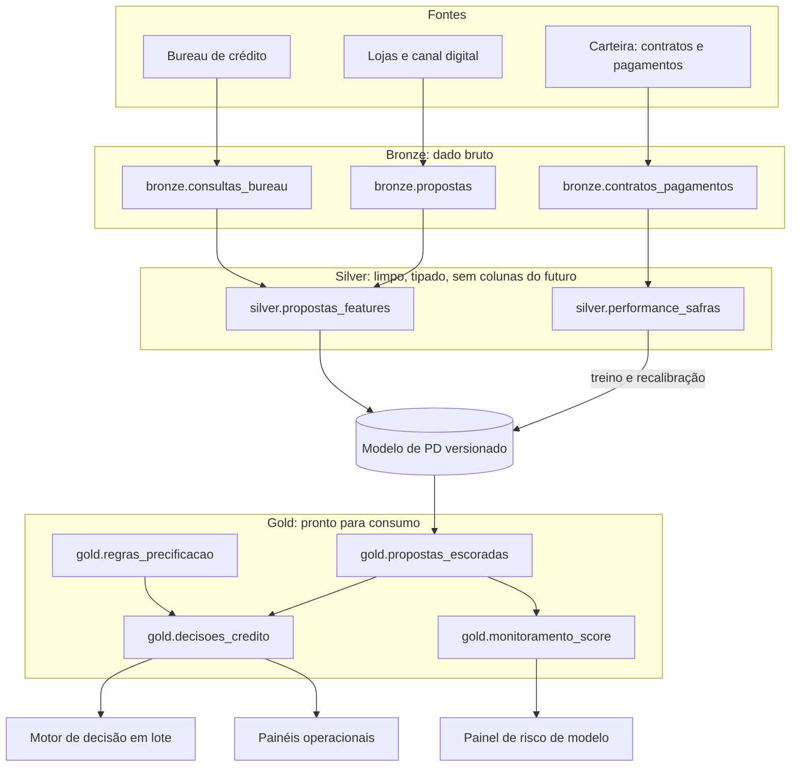

# Camada Gold: desenho de produção do AutoCred

> **Status.** Este é o desenho de como o modelo e a política iriam para produção. O desafio não foi
> implantado num Data Lake. O protótipo em [`src/autocred/camada_gold.py`](../../src/autocred/camada_gold.py)
> monta as quatro tabelas Gold com o modelo e a política reais, e as consultas de
> [`consultas_gold.sql`](consultas_gold.sql) rodam sobre elas num SQLite em memória, no lugar do
> Databricks SQL.

## Para que serve

Num notebook, o modelo de PD e a política de preço respondem a perguntas. Em produção, eles viram
tabelas que outros sistemas consultam. A camada Gold é onde essas tabelas ficam, prontas para três
consumidores:

- **motor de decisão em lote:** ofertas pré-aprovadas, reprocessamento de propostas, simulações do
  comitê de crédito;
- **painéis operacionais:** aprovação, taxa ofertada e volume por canal, loja e score;
- **risco de modelo:** estabilidade da população que chega e desempenho de cada faixa de score.

A decisão em tempo real (a loja espera a resposta em segundos) usa o mesmo modelo e a mesma tabela de
regras, servidos por API. A Gold registra cada decisão, com as versões do modelo e da política, para
auditoria e para tudo o que roda em lote.

## Arquitetura



| Camada | O que guarda | Equivalente no desafio |
|---|---|---|
| Bronze | O dado como chegou: propostas, consultas ao bureau, contratos e pagamentos. Tem dado pessoal, com acesso restrito. | Os CSVs das bases A, B e C |
| Silver | Dado limpo e tipado, com as features do modelo e o desfecho de cada safra. A trava de vazamento (`dados.validar_sem_proibidas`) roda aqui. | `dados.py` e `features.py` |
| Gold | Tabelas de negócio, sem dado pessoal, prontas para consulta. | Este documento |

## As quatro tabelas

### `gold.propostas_escoradas`

Uma linha por proposta e versão do modelo. Atualização diária, particionada pelo mês de `data_proposta`.

| Coluna | Tipo | Descrição |
|---|---|---|
| `id_proposta` | string | Chave da proposta |
| `data_proposta` | date | Data do pedido |
| `canal_originacao` | string | Concessionária, revenda, digital ou correspondente |
| `valor_financiado_desejado` | decimal | Quanto o cliente pediu |
| `prazo_desejado_meses` | int | Prazo pedido |
| `pct_entrada_desejada` | double | Entrada que o cliente quer dar |
| `pd` | double | Probabilidade de inadimplência 90/12 |
| `score_1a10` | int | Faixa de risco (1 = maior risco) |
| `fora_perfil` | boolean | Fora do que a política antiga aprovava |
| `versao_modelo` | string | Versão registrada do modelo que escorou |
| `data_processamento` | date | Quando a linha foi gravada |

### `gold.regras_precificacao`

A política por score, versionada. Uma versão nova fecha a anterior preenchendo `vigente_ate`
(histórico tipo SCD2), então qualquer decisão antiga pode ser reproduzida com a regra da época.

| Coluna | Tipo | Descrição |
|---|---|---|
| `versao_politica` | string | Identificador da política aprovada no comitê |
| `score_1a10` | int | Faixa de risco |
| `aprovar` | boolean | Se a faixa é aprovada |
| `taxa_am` | double | Taxa ao mês ofertada (teto de 3,5%) |
| `prazo_max_meses` | int | Prazo máximo |
| `entrada_min_pct` | double | Entrada mínima exigida |
| `aceita_fora_perfil` | boolean | Se aprova propostas fora do perfil histórico |
| `vigente_desde` / `vigente_ate` | date | Vigência; `vigente_ate` nulo é a regra em vigor |

### `gold.decisoes_credito`

Uma linha por proposta decidida, com o motivo e as condições. Particionada pelo mês da proposta.

| Coluna | Tipo | Descrição |
|---|---|---|
| `id_proposta`, `data_proposta`, `canal_originacao`, `score_1a10`, `fora_perfil` | | Vindos de `propostas_escoradas` |
| `decisao` | string | `APROVAR` ou `NEGAR` |
| `motivo` | string | `aprovada`, `score abaixo do corte` ou `fora do perfil` |
| `taxa_am`, `prazo_ofertado_meses`, `entrada_min_pct` | | Condições ofertadas; nulas quando nega |
| `versao_modelo`, `versao_politica` | string | Linhagem: com as duas, a decisão pode ser refeita |

### `gold.monitoramento_score`

A distribuição por score de cada população (safras da carteira e propostas novas) contra uma
referência, com a contribuição de cada faixa para o PSI. Atualização mensal.

| Coluna | Tipo | Descrição |
|---|---|---|
| `populacao` / `referencia` | string | O que é comparado com o quê |
| `score_1a10` | int | Faixa |
| `qtd`, `pct`, `pct_referencia` | | Contagem e participação nas duas populações |
| `contribuicao_psi` | double | Soma por população = PSI |
| `data_processamento` | date | Quando foi calculado |

## Como o consumo acontece

**Todo dia:** as propostas chegam na Bronze; a Silver tipa, calcula as features e aplica a trava de
vazamento; um job escora com a versão do modelo em produção e grava `propostas_escoradas`; outro cruza
com a regra em vigor e grava `decisoes_credito`.

**Todo mês:** o monitoramento compara a população que chegou com a referência e grava
`monitoramento_score`. PSI acima de 0,10 acende o alerta; acima de 0,25 pede revisão do modelo.

As consultas de exemplo estão em [`consultas_gold.sql`](consultas_gold.sql):

| Consulta | Consumidor | O que faz |
|---|---|---|
| `motor_de_decisao_em_lote` | Motor de decisão | Cruza cada proposta com a regra em vigor e devolve decisão, motivo e condições |
| `painel_aprovacao_por_canal` | Painel operacional | Propostas, aprovação e taxa média por canal |
| `painel_por_score` | Painel operacional | O que a política fez em cada faixa de score |
| `monitoramento_psi` | Risco de modelo | PSI de cada população, com a leitura estável, atenção ou drift severo |

## O protótipo com os dados do desafio

`scripts/gerar_camada_gold.py` monta as tabelas com o modelo final e a política adotada e confere que:

- a decisão da tabela Gold é a mesma da submissão oficial, nas 5.000 propostas: 2.241 aprovadas,
  os 44,8% de aprovação da apuração;
- a consulta SQL do motor de decisão devolve a mesma decisão que o código Python;
- o PSI entre as safras de 2023 e 2024 é o mesmo publicado na página (0,0015).

Aprovação por canal (consulta `painel_aprovacao_por_canal`):

| Canal | Propostas | Aprovação | Taxa média |
|---|---:|---:|---:|
| Concessionária | 2.009 | 51,1% | 2,54% a.m. |
| Revenda multimarca | 1.389 | 38,5% | 2,59% a.m. |
| Digital | 891 | 45,9% | 2,55% a.m. |
| Correspondente bancário | 711 | 38,1% | 2,59% a.m. |

Monitoramento (consulta `monitoramento_psi`, referência: contratos de 2023):

| População | PSI | Leitura |
|---|---:|---|
| Contratos de 2022 | 0,0069 | estável |
| Contratos de 2024 | 0,0015 | estável |
| Contratos de 2025 (Base B) | 0,0057 | estável |
| Propostas do 2º semestre de 2025 (Base C) | 0,3764 | drift severo |

A carteira aprovada é estável de um ano para o outro. As propostas novas não são: 35,6% delas caem no
score 1, contra cerca de 12% nas safras da carteira. Quem pede crédito é diferente de quem a política
antiga aprovava. É o viés de seleção que levou a política a dobrar a PD dos casos fora do perfil, e é
exatamente o tipo de mudança que o monitoramento existe para mostrar antes que vire prejuízo.

## Qualidade e governança

- **Checagens antes de publicar** (`camada_gold.validar`): chave única por proposta, PD entre 0 e 1,
  score de 1 a 10, uma única regra em vigor por score, taxa dentro do teto, uma decisão para cada
  proposta escorada, condições nulas quando a proposta é negada e distribuições que somam 100%.
- **Versionamento:** o modelo tem versão registrada; a política tem vigência. Toda decisão guarda as
  duas versões.
- **Privacidade:** a Gold não tem dado pessoal, só o identificador da proposta. CPF e nome ficam na
  Bronze, com acesso restrito.
- **Sem vazamento:** as features vêm da Silver, onde a trava impede colunas apuradas depois da
  concessão.

## No Databricks

| Peça do desenho | No Databricks |
|---|---|
| Tabelas Gold | Tabelas Delta no Unity Catalog: `autocred.gold.<tabela>` |
| Jobs diários e mensais | Databricks Jobs agendados |
| Checagens de qualidade | Expectations de um pipeline declarativo (Lakeflow Declarative Pipelines) |
| Versão do modelo | Modelo registrado no MLflow; `versao_modelo` é a versão registrada |
| Acesso | O motor de decisão lê `decisoes_credito` e `regras_precificacao`; o BI lê decisões e monitoramento |

## Rodar o protótipo

Depois dos notebooks (que geram `saidas/`):

```bash
python scripts/gerar_camada_gold.py
```

As tabelas vão para `saidas/gold/` em CSV, as quatro consultas são executadas e as conferências são
impressas no fim. Os testes de `tests/test_camada_gold.py` usam dados sintéticos e rodam sem o modelo.
